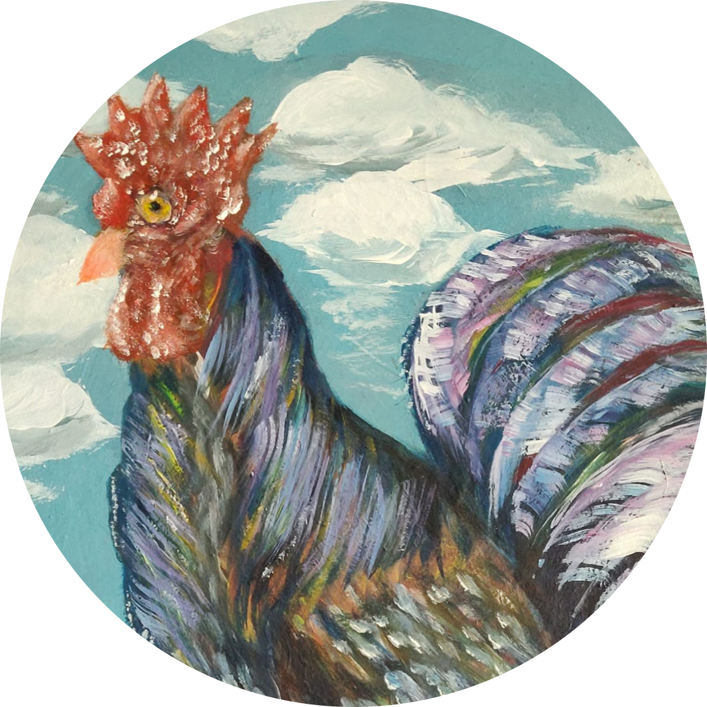

<!DOCTYPE html>
</html>
<html lang="en">
<head>
    <meta charset="UTF-8">
    <meta http-equiv="X-UA-Compatible" content="IE=edge">
    <meta name="viewport" content="width=device-width, initial-scale=1.0">
    <link rel="stylesheet" href="polancoartist.css">
    <link rel="stylesheet" href="View.scss">
    <link href="https://vjs.zencdn.net/7.15.4/video-js.css" rel="stylesheet" />
    <link rel="stylesheet" href="normalize.css"> 
    
    <link rel="stylesheet" href="https://cdn.jsdelivr.net/npm/pace-js@latest/pace-theme-default.min.css">
   
</head>
<body >

    
<header>
  

<!--este es tu contador-->

<!--aqui empieza tu pagina-->
 
  <!--perfil--> 
  

      <!--Nombre-->      

    
Polancoartist 3D

       </header> 

       
Nombre: PolancoArtist3D 

       
Obgetivo: proporcionar contenido 3D 

       
Tipo:OpenGL 3D SRC 

<!--modelo t3D-->

 <iframe width="100%" height="500" title="Rinon" frameborder="0" allowfullscreen mozallowfullscreen="true" webkitallowfullscreen="true" allow="autoplay; fullscreen; xr-spatial-tracking" xr-spatial-tracking execution-while-out-of-viewport execution-while-not-rendered web-share src="https://sketchfab.com/models/b83e07bb7b35413dafd1fad8b942e7a1/embed"> </iframe> 
 <a href="https://sketchfab.com/3d-models/rinon-b83e07bb7b35413dafd1fad8b942e7a1?utm_medium=embed&utm_campaign=share-popup&utm_content=b83e07bb7b35413dafd1fad8b942e7a1" target="_blank" style="font-weight: bold; color: #1CAAD9;"> Rinon </a> by <a href="https://sketchfab.com/bizarrecartoon?utm_medium=embed&utm_campaign=share-popup&utm_content=b83e07bb7b35413dafd1fad8b942e7a1" target="_blank" style="font-weight: bold; color: #1CAAD9;"> Erick Polanco </a> on <a href="https://sketchfab.com?utm_medium=embed&utm_campaign=share-popup&utm_content=b83e07bb7b35413dafd1fad8b942e7a1" target="_blank" style="font-weight: bold; color: #1CAAD9;">Sketchfab</a>

Nombre: riñones 

audio:none

Formato:glb 3D model

<!--Guide-->

  <a class="responsive-btn" href="https://erickpolancoh.github.io/Guide/">GUIDE</a>
  <a class="responsive-btn" href="https://erickpolancoh.github.io/Polan3Dvewer/">Click to the next Page</a>

<a class="btn" href="Rinon.glb" download="rinon.glb" title="Download">Download Model</a>

     
 
 </body>
</html>

                         
                                                       
                          
